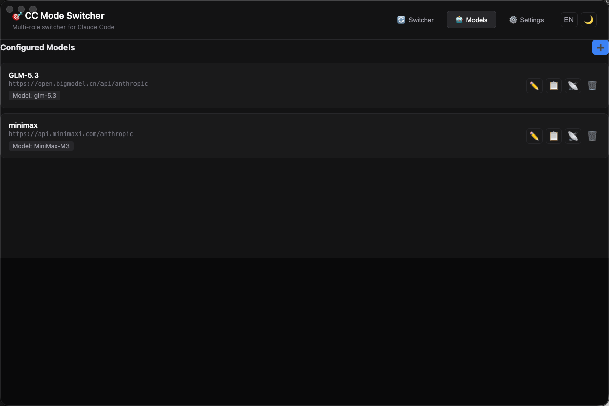
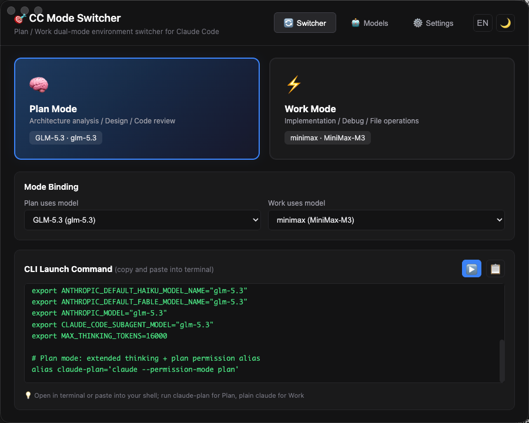
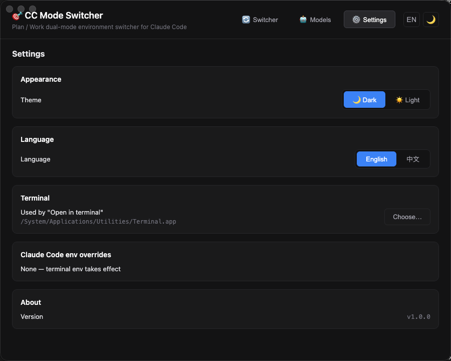

# 🎯 CC Mode Switcher

[English](README.md) | **简体中文**

[Claude Code](https://claude.com/product/claude-code) 的 Plan / Work 双模式环境切换器。给两种模式分别绑定不同的模型 —— 例如 **Plan**（架构 / 设计 / 评审）用推理模型、**Work**（实现 / 调试）用快速模型 —— 一键以正确的模式启动 Claude Code。

基于 Electron + Vue 3 + TypeScript 构建。

## 设计初衷

灵感来自 Anthropic 内部的任务自动路由：偏 plan 的任务会走某些模型，偏执行的任务会走其他模型。就像一家公司——高层的智商和认知与底层员工不同，做 plan 的和做 execution 的本来就不是一拨人，薪资成本自然也不同。

本工具做不到那么智能，只画了一条最简单的分界线——**plan 与非 plan**。因为对接的是 Claude Code，路由就交给人为约定：由你决定哪个模型负责思考（Plan）、哪个负责执行（Work）。昂贵的推理 token 只花在刀刃上，机械执行交给便宜的模型。

## 功能

### 🤖 模型管理
- 新增 / 编辑 / 复制 / 删除模型配置（显示名称、Base URL、API Key、模型 ID）
- **拖拽排序**（把手拖动，带上/下落点指示线）
- **Provider 预设** + URL 自动补全 —— 智谱 GLM、MiniMax、DeepSeek、Kimi（月之暗面）、Z.ai、通义千问（DashScope）
- 输入名称或模型 ID（`glm-5.3`、`MiniMax-M3`……）自动填入 Base URL
- 匹配到 Provider 后显示模型 ID 快捷 chips
- 每个模型可**测试连接** —— 绿色 toast 显示延迟（`连接成功 143ms`），红色 toast 显示网络错误



### 🔄 Plan / Work 切换器
- 两种模式各绑定一个模型；复制生成的配置紧跟原条目下方（`X copy`、`X copy (1)`……）
- 删除需经 Modal 对话框二次确认
- 按当前模式生成可直接粘贴的 shell 片段



### ▶️ 在终端中打开
- 首次使用：通过文件选择器选择终端应用（Terminal.app、iTerm 或其他 —— 通用回退为生成 `.command` 文件）
- 打开新的终端窗口，并在该 session 内临时定义**当前选中模式**的 alias —— **不会写入 `~/.zshrc`**
- Plan 模式输入 `cc-p`、Work 模式输入 `cc-w`；echo 就绪提示

### 🚫 绝不触碰 Claude Code 配置
Claude Code 的 `~/.claude/settings.json` 中 `env` 块的优先级**高于终端环境变量**。本应用靠每个 alias 上的两个 flag 绕开它：
- `--setting-sources ""` —— Claude Code **完全跳过**所有默认 settings 文件（user / project / local）
- `--settings "$CC_MODE_DIR/<ModelName>.json"` —— 以**最高优先级**加载该模型绑定的临时 JSON，覆盖一切
- 本应用**从不读、不写** `~/.claude/settings.json` 或任何 settings 文件 —— 无需备份，不会冲突

### 📦 发布与版本管理（GitHub Actions，手动）
macOS / Windows / Linux 安装包发布在 GitHub Release —— **[点此下载最新版](https://github.com/leochan007/cc-mode-switcher/releases/latest)**，各系统安装说明见[下载页](https://leochan007.github.io/cc-mode-switcher/zh/download)。

发布通过 **三个手动工作流** 驱动 —— 无自动触发，零本地命令：
- **List releases** —— 动手前先看服务器上有哪些版本
- **Set version & tag** —— 升级（patch / minor / major）、降级、或任意版本。提交 `release vX.Y.Z` 并推 tag
- **Release Electron App** —— 三平台并行构建，创建 / 更新 GitHub Release

完整操作指南：[发布与版本管理](/zh/guide/07-release-versioning)。

### ⚙️ 设置与细节
- 🌙 深色（默认）/ ☀️ 浅色主题 —— 基于 CSS 变量，头部或设置页均可切换
- English（默认）/ 简体中文 —— 头部或设置页快捷切换
- 图标按钮 + 悬停 tooltip
- 居中显示的 toast 通知
- 所有配置持久化到 `localStorage`



## 生成的别名

textarea 显示的、也是 ▶️ 发送到新终端的内容，**始终跟随上方 Plan / Work 卡片的选择**。下面示例为 Plan 选中、绑 GLM-5.3：

```bash
# Plan：开启 extended thinking + plan 权限模式
export ANTHROPIC_BASE_URL="https://open.bigmodel.cn/api/anthropic"
export ANTHROPIC_AUTH_TOKEN="sk-..."
export ANTHROPIC_DEFAULT_OPUS_MODEL="glm-5.3"
export ANTHROPIC_DEFAULT_SONNET_MODEL="glm-5.3"
export ANTHROPIC_DEFAULT_HAIKU_MODEL="glm-5.3"
export ANTHROPIC_DEFAULT_FABLE_MODEL="glm-5.3"
export ANTHROPIC_DEFAULT_OPUS_MODEL_NAME="glm-5.3"
export ANTHROPIC_DEFAULT_SONNET_MODEL_NAME="glm-5.3"
export ANTHROPIC_DEFAULT_HAIKU_MODEL_NAME="glm-5.3"
export ANTHROPIC_DEFAULT_FABLE_MODEL_NAME="glm-5.3"
export ANTHROPIC_MODEL="glm-5.3"
export CLAUDE_CODE_SUBAGENT_MODEL="glm-5.3"
export MAX_THINKING_TOKENS=16000

# 临时 settings 文件（通过 --settings 以最高优先级加载）。
# 文件名 = 当前绑定的模型显示名 → 在 $CC_MODE_DIR 里一眼能找到。
CC_MODE_DIR=$(mktemp -d -t cc-mode-XXXXXX)

cat > "$CC_MODE_DIR/GLM-5.3.json" <<'CCMODE_EOF'
{
  "env": {
    "ANTHROPIC_BASE_URL": "https://open.bigmodel.cn/api/anthropic",
    "ANTHROPIC_AUTH_TOKEN": "sk-...",
    "ANTHROPIC_DEFAULT_OPUS_MODEL": "glm-5.3",
    "ANTHROPIC_DEFAULT_SONNET_MODEL": "glm-5.3",
    "ANTHROPIC_DEFAULT_HAIKU_MODEL": "glm-5.3",
    "ANTHROPIC_DEFAULT_FABLE_MODEL": "glm-5.3",
    "ANTHROPIC_DEFAULT_OPUS_MODEL_NAME": "glm-5.3",
    "ANTHROPIC_DEFAULT_SONNET_MODEL_NAME": "glm-5.3",
    "ANTHROPIC_DEFAULT_HAIKU_MODEL_NAME": "glm-5.3",
    "ANTHROPIC_DEFAULT_FABLE_MODEL_NAME": "glm-5.3",
    "ANTHROPIC_MODEL": "glm-5.3",
    "CLAUDE_CODE_SUBAGENT_MODEL": "glm-5.3",
    "MAX_THINKING_TOKENS": "16000"
  }
}
CCMODE_EOF

# 别名 —— --setting-sources "" 禁用默认源；--settings 以最高优先级加载临时文件
alias cc-p='claude --permission-mode plan --setting-sources "" --settings "$CC_MODE_DIR/GLM-5.3.json"'
```

切到 Work 卡片会自动重新生成同一结构——去掉 `MAX_THINKING_TOKENS` 行，临时文件变 `$CC_MODE_DIR/MiniMax-M3.json`，别名变 `cc-w='claude --setting-sources "" --settings "$CC_MODE_DIR/MiniMax-M3.json"'`。切完卡片再点 ▶️ 就开一个新 terminal 跑新模式。

`--setting-sources ""` 跳过所有默认 settings 文件（user / project / local），所以 `~/.claude/settings.json` 永远不会被加载；`--settings "$CC_MODE_DIR/<ModelName>.json"` 再以**最高优先级**加载对应模型的临时 JSON，让它成为单一来源。

## 编译环境要求

| 依赖 | 版本 | 说明 |
| --- | --- | --- |
| Node.js | ≥ 22（推荐 24+） | Vite 7 要求 Node 20.19+ / 22.12+；本项目以 Node 24 为目标 |
| pnpm | ≥ 9 | 推荐 —— 锁文件为 `pnpm-lock.yaml`（npm ≥ 10 也可以） |
| macOS | 12+ | Apple Silicon 或 Intel 均可。打包安装包需要 Xcode 命令行工具（`xcode-select --install`） |

> Windows/Linux：界面可以正常构建运行，但**「在终端中打开」目前仅支持 macOS**（依赖 AppleScript / `.command` 文件）。

### ⚠️ pnpm ≥ 10 注意

pnpm 10 默认拦截依赖的 postinstall 脚本，Electron 二进制不会下载，`npm run dev` 会报 `Error: Electron uninstall`。解决：

```bash
pnpm approve-builds   # 勾选 electron（和 esbuild）
```

或在安装前于 `package.json` 中添加：

```json
"pnpm": { "onlyBuiltDependencies": ["electron", "esbuild"] }
```

## 国内镜像加速

加速依赖与 Electron 二进制下载：

```bash
# npm/pnpm 源
pnpm config set registry https://registry.npmmirror.com

# Electron 二进制 + electron-builder 辅助二进制
export ELECTRON_MIRROR=https://npmmirror.com/mirrors/electron/
export ELECTRON_BUILDER_BINARIES_MIRROR=https://npmmirror.com/mirrors/electron-builder-binaries/
```

或在项目根目录放一个 `.npmrc`：

```ini
registry=https://registry.npmmirror.com
electron_mirror=https://npmmirror.com/mirrors/electron/
electron_builder_binaries_mirror=https://npmmirror.com/mirrors/electron-builder-binaries/
```

## 快速开始

```bash
pnpm install   # 或 npm install
npm run dev    # 启动开发服务 + Electron
```

其他脚本：

```bash
npm run build   # 构建 main/preload/renderer 产物
npm run dist    # 打包安装包（electron-builder）
```

## 扩展 Provider 预设

在 [`src/renderer/src/data/providers.ts`](src/renderer/src/data/providers.ts) 中加一条即可 —— 表单自动补全、关键词自动填入、模型 ID chips 都会自动生效：

```ts
{
  id: 'glm',
  name: 'GLM (Zhipu)',
  baseUrl: 'https://open.bigmodel.cn/api/anthropic',
  keywords: ['glm', 'bigmodel', 'zhipu', '智谱'],
  models: ['glm-5.3', 'glm-5.3-air', 'glm-4.6', 'glm-4.5']
}
```

任何 Anthropic 兼容端点都可用。

## 使用文档

完整的分章节文档在 [`docs/zh/`](docs/zh/)（[English version](docs/)）：

- [快速上手](docs/zh/guide/01-getting-started.md) —— 五步完成首次配置
- [模型与 Provider 配置](docs/zh/guide/02-models-and-providers.md) —— 预设、环境变量、覆盖防护、模型分工建议
- [Plan 模式实战](docs/zh/guide/03-plan-mode-playbook.md) —— 生成 plan 文档（中间产物）的方法论与提示词模板
- [Work 模式实战](docs/zh/guide/04-work-mode-playbook.md) —— 严格按 plan 执行、绝不另起 plan 的铁律
- [端到端示例](docs/zh/guide/05-workflow-example.md) —— 一个功能从需求到交付的全过程
- [发布与版本管理](docs/zh/guide/07-release-versioning.md) —— GitHub Actions 工作流：云端构建、升级 / 降级、发布 GitHub Release（全手动，零本地命令）
- [本地构建](docs/zh/guide/06-local-build.md) —— 干净重建：清除 node_modules、pnpm store、electron / electron-builder 缓存后重新安装（`pnpm run dev` / `pnpm run dist` 出问题时）

## 项目结构

```
src/
├── main/            # Electron 主进程（IPC、终端启动）
├── preload/         # contextBridge API
└── renderer/
    └── src/
        ├── components/    # Vue 组件（面板、卡片、弹窗、toast……）
        ├── composables/   # 模型、i18n、主题、终端、toast
        ├── i18n/          # 中英文文案
        ├── data/          # Provider 预设
        └── assets/        # 全局样式
```

## 发布流程

发布是**两步手动操作**——全自动触发一律没有。两步都在 GitHub 的 Actions 页面里完成，不需要本地命令行。

| 步骤 | 工作流 | 作用 |
| --- | --- | --- |
| 1 | **Set version & tag** | 写入 `release vX.Y.Z` 提交，把 `vX.Y.Z` tag 推到 origin。旧的 tag / release 一个不动。 |
| 2 | **Release Electron App** | 构建 mac / win / linux 产物，创建或更新 GitHub Release。 |

还有个辅助工作流 **List releases**，在动手前先看看服务器上已经有哪些版本。

### 一次性配置（在 GitHub 网页上）

仓库 → **Settings → Actions → General** → **Workflow permissions** → 选 **Read and write permissions** → Save。不设这个 runner 推不回去。

### 看现有版本

Actions → **List releases** → **Run workflow** → 等 → 进这次运行 → 展开 **Print releases + tags**。输出两段：

- **Releases**（`gh release list`）—— 所有 GitHub Release，带状态（Published / Draft / Pre-release）
- **Tags**（`git ls-remote --tags`）—— 所有 tag，包括 release 被删了的

第二段有、第一段没有的 tag → 它的 release 被删了 —— 第 2 步填这个 tag 就能重发。

### 升级（自动算 patch / minor / major）

Actions → **Set version & tag** → **Run workflow**：

| 输入 | 值 |
| --- | --- |
| `mode` | `auto` |
| `bump` | `patch`（或 `minor` / `major`） |
| `version` | 留空 |

会改 `package.json` + `pnpm-lock.yaml` + `SettingsPanel.vue` 里的版本号，提交 `release vX.Y.Z`，推 tag。**不构建**，还得走第 2 步。

### 直接指定版本（升级 或 降级）

Actions → **Set version & tag** → **Run workflow**：

| 输入 | 值 |
| --- | --- |
| `mode` | `set` |
| `bump` | 无所谓 |
| `version` | `2.0.0`（任意值，比当前低就是降级，比如 `0.9.6`） |

效果同上，但目标版本是你填的。降级不破坏旧的——之前的 tag 和 release 完整保留。

如果填的 tag 在 origin 上已经存在，工作流**直接 abort**，提示你换个版本号或者用第 2 步重跑那个 tag。

### 构建并发布 GitHub Release

Actions → **Release Electron App** → **Run workflow**：

| 输入 | 值 |
| --- | --- |
| `tag` | 留空（构建当前 main HEAD——也就是第 1 步刚推上去的那个提交） |

runner checkout 这个 ref，跑 `electron-builder --publish always`，按 `package.json` 里的版本号创建 GitHub Release。mac / win / linux 并行构建。

### 重新发布某个 tag（误删恢复、重打）

Actions → **Release Electron App** → **Run workflow**：

| 输入 | 值 |
| --- | --- |
| `tag` | `v1.0.0`（填要重打的 tag） |

runner checkout 这个 tag，重新构建，用新产物覆盖已有 Release。

### 删 release / tag

工作流从不主动删。要清理由你手动：

GitHub 网页：仓库 → Releases → 找到要删的，点垃圾桶图标。

或者本地有 `gh` CLI：
```bash
# 只删 Release（tag 留着——上面「重新发布」流程能恢复）
gh release delete v1.0.0

# Release 和 tag 都删
gh release delete v1.0.0 --yes
git push origin --delete v1.0.0
```

或者更保守：在 GitHub UI 把 Release 改成 **Draft** 隐藏起来，tag 和所有产物都还在。

## 常见问题

**为什么本应用不读写我的 `~/.claude/settings.json`？**
不需要。每个 alias 都带两个 flag 启动 Claude Code：`--setting-sources ""` 完全跳过 user / project / local 三层 settings，`--settings "$CC_MODE_DIR/<ModelName>.json"` 再以**最高优先级**加载每次点击新生成的临时 JSON（以绑定模型显示名命名）。app 的配置只活在 `$CC_MODE_DIR` 里，从不碰用户的 home 目录。

**开发时日志里的 `TSM AdjustCapsLock…` / `IMKCFRunLoopWakeUpReliable` 是什么？**
macOS 输入法框架的无害噪音，所有 Electron 应用都有。渲染进程若崩溃，窗口会自动重载。

## 许可证

[MIT](LICENSE) © 2026 leochan007
